# MusicTvBoxMobile
MusicFree 与 TvBoxOS-Mobile合并项目

一、开发初衷:

之前网上看到musicfree，发现他的插件化管理音乐平台和tvbox如出一辙，为了方便用户和接口统一，于是决定把他们合并。

二、合并分析:

musicfree是采用React Native开发的，直接合入到tvboxos-mobile很困难，所以只能参考musicfree界面和接口用java实现。这里说一下musicfree的开发接口文档确实很详细，设计也很合理，原本想直接适配musicfree的接口，但是其接口用到了很多js语言特性，在原本就很鸡肋的Android js框架下难以完全运行，我自己也对js代码只是能看懂但是修改不熟悉，我添加了pyramid模块，便于支持python爬虫，前期验证推荐使用python爬虫，虽说性能有一点点影响，但代码少，能快速验证接口。至于java爬虫肯定是支持的，只是没时间去打包。

三、功能说明:

1、已完成本地音乐扫描和播放。

2、已完成歌曲平台和tvbox接口统一，即支持自定义添加歌曲平台，支持在线或者本地py，js，java爬虫，具体参见下面接口。

3、已完成自定义歌单，暂不支持修改歌单名字和介绍。

4、已完成歌曲变下边播功能，有缓存，支持后台播放，通知栏控制等。

5、已完成歌单和播放历史存入本地数据库，卸载重装不丢失。

6、已完成歌曲平台歌单导入。

7、目前只适配了歌曲名搜索，还没有适配歌手搜索，专辑搜索，并可以根据颜色标记无版权，vip，非vip歌曲。

8、已完成歌词搜索、解析和滚动显示。

9、已完成音乐平台榜单适配。

10、已完成音乐平台推荐歌单适配。

11、已完成播放动效(参考网易云)。

12、已完成播放器均衡器音效调节。

13、正在开发第三方音效支持，耳机适配音效、BASS、蝰蛇音效等。

四、接口使用

新增音乐平台爬虫插件是在原有的tvbox标准接口中添加了一个"music"字段，对影视爬虫接口无影响。

建议调试python爬虫，我这边测试也全部是Python写的，毕竟没有什么语言比Python写爬虫更快，更短。

音乐爬虫主要实现下面四个接口(可参考仓库中的py_fangpi.py，也可以参考musicfree接口文档，和其类似):
===》如果不想实现，可以直接看《六、快速使用》。

1、歌曲搜索接口:search(query, page, type)

query: 搜索关键字

page: 搜索起始页码，暂未使用

type: 搜索类型，单曲，专辑，歌手，歌单

2、歌曲播放源接口:getMediaSource(id, ext, quality)

id: 歌曲id

ext: 歌曲扩展字段

quality: 歌曲音质

3、歌词获取接口:getLyric(id, ext)

id: 歌曲id

ext: 歌曲扩展字段

4、歌单导入接口:importMusicSheet(urlLike)

urlLike: 歌单分享地址

然后在原tvbox原接口中添加音乐爬虫插件即可使用:
仓库例子：

{

  // 这里新增music爬虫接口

 "music": [ 

    { 

   "key": "py_music_fangpi", 

   "name":"放屁音乐", 

   "url":"file:///storage/emulated/0/plugin/py_fangpi.py", 

   "version":"0.1.7" 

  }, 

  { 

   "key": "py_music_audiomack", 

   "name":"Audiomack", 

   "url":"file:///storage/emulated/0/plugin/py_audiomack.py", 

   "version":"0.0.2" 
  } 
  ], 

// 以下为原有的影视爬虫接口

"spider": "./lib/spider.jar;md5;F20B74480C058B1FF6236601F92D65A8", 

"wallpaper":"https://tuapi.eees.cc/api.php?category=meinv&type=302", 

"lives": [ {xxx}]

}

五、快速使用

下面使用raw.liucn.cc/box/m.json库修改的，已经适配了音乐平台，导入app的订阅源即可使用。
https://gcore.jsdelivr.net/gh/HuShanquan3/box2/m4.json

Enjoy movies and music！！！！！！

六、APP下载地址

下载:https://www.lanzouw.com/icTzq1ulrmkh 密码:dpdt

参考:

1、https://github.com/XiaoRanLiu3119/TVBoxOS-Mobile

2、https://github.com/maotoumao/MusicFree

3、https://github.com/maotoumao/MusicFreePlugins

七、APP截图

APP影视界面

APP音乐界面

搜索界面

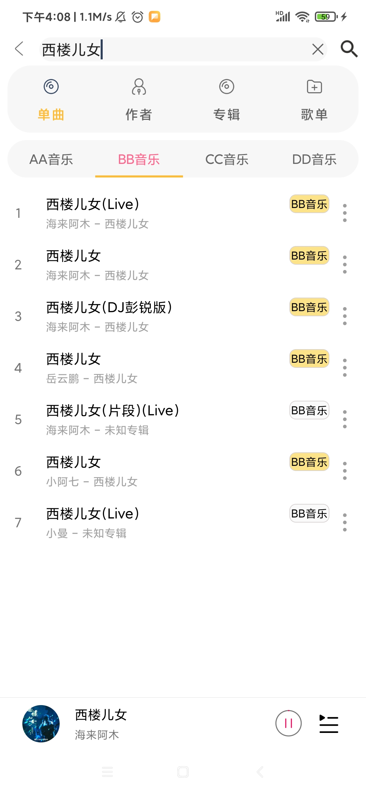

动效

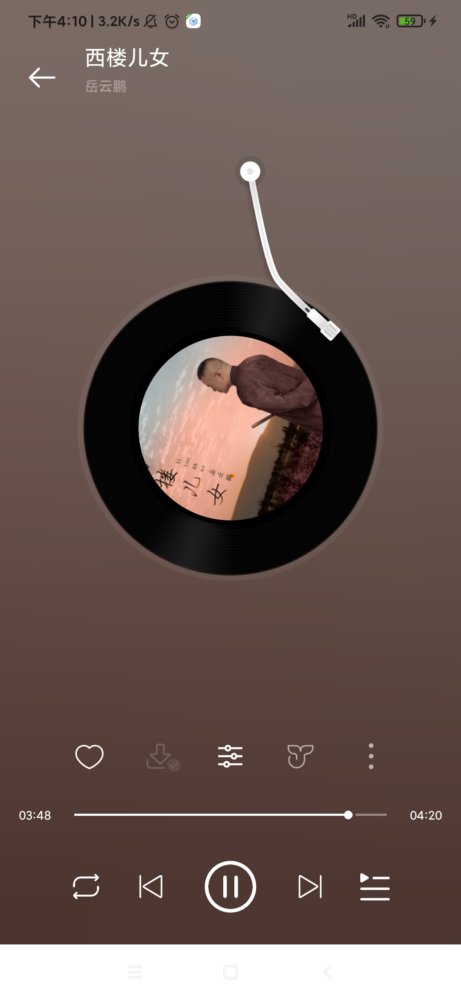
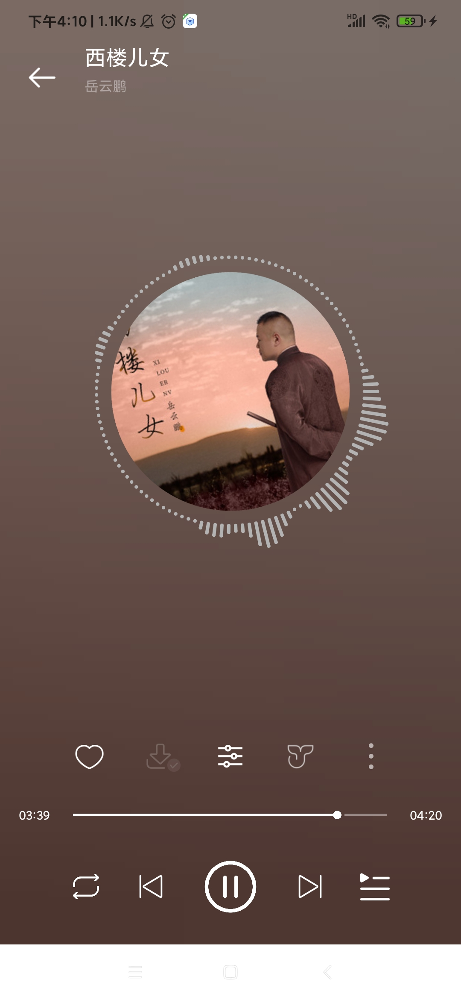
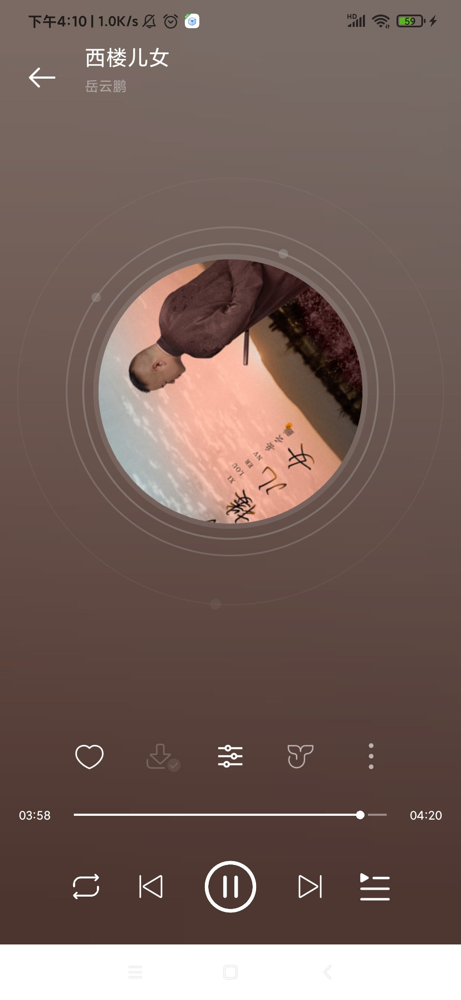
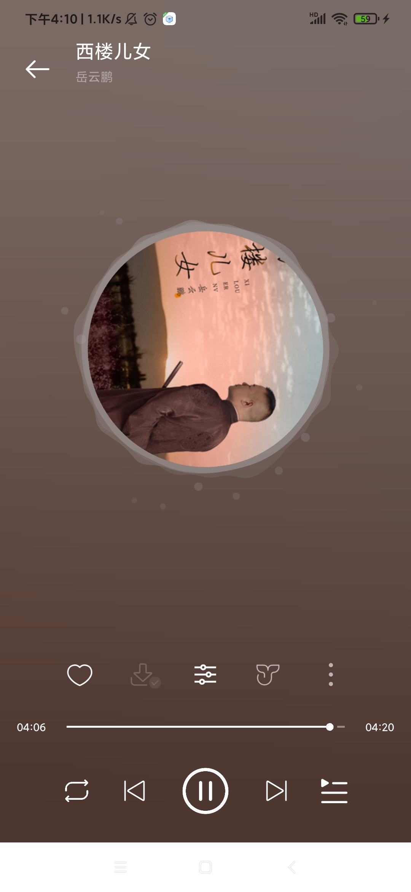
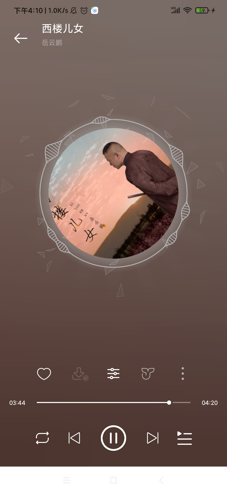

动效设置

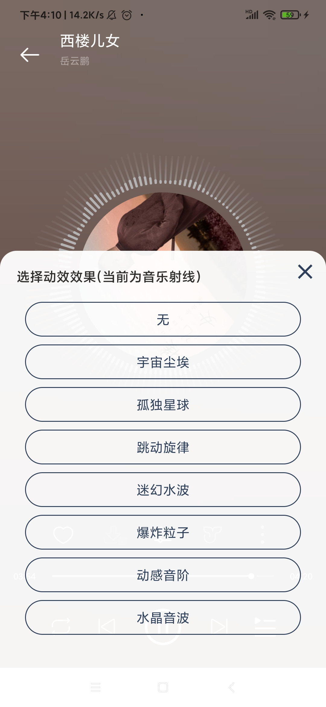

音效设置

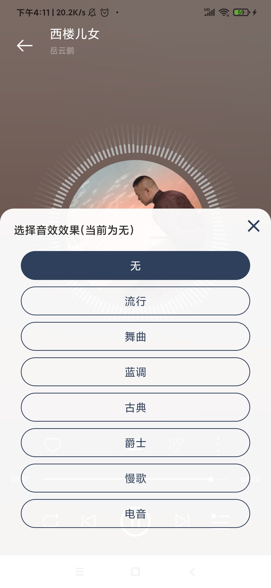

歌曲详情

榜单

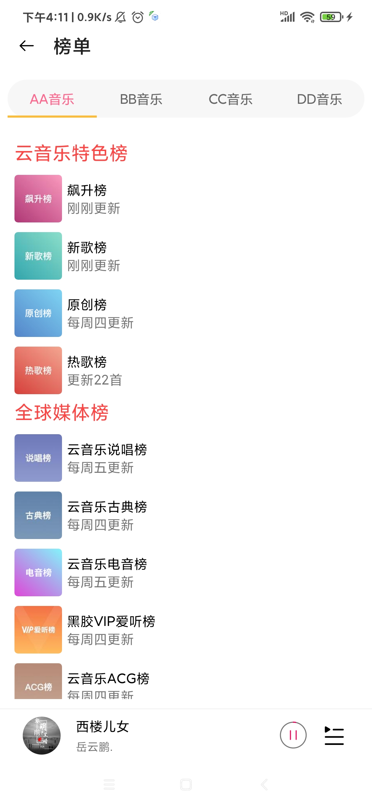

歌单广场

导入歌单

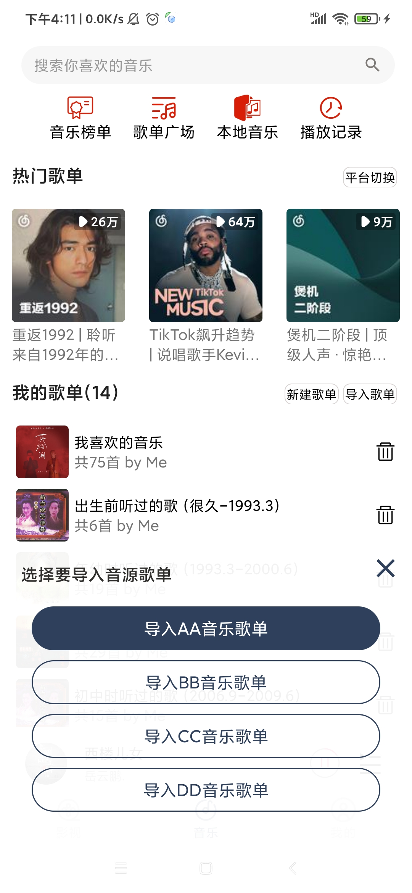

歌单详情

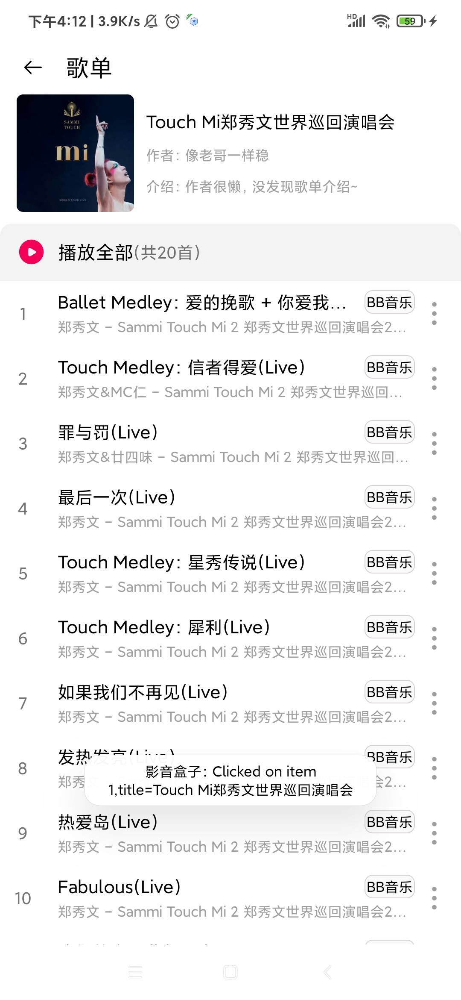

八、后续扩展:

后续可能会用这种插件化的思想集成短视频，小说，K歌等。